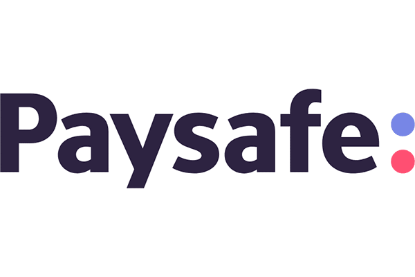

## Welcome to my page

Hi, I'm Aaron. I'm just trying to make an effort to do something better while showing a bit more personality than you might normally get through a resume or a normal application. 

Not sure if I should make this into just another visual resume or include other things like hobbies too like skin care, sports, or custom keyboards (this is what I am currently interested in).

No idea how often I will be updating this (usually happens when I find myself stuck feeling unproductive) but hopefully I can make some more regular updates. 

Also I want to try changing the themes here and there to find what suits me but that is for future Aaron to figure out. 

### about me

I am a UCSD'21 graduate. My time there was spent getting my Bachelors in Data Science (so new, so cool) and a minor in Cognitive Science. I would say I got a really broad exposure to the data science field as a whole learning about machine learning, cloud computing, data viz, and the whole data science lifecycle. As someone who enjoys coding, my time learning Python and SQL was probably my favorite. 

I am also a pretty avid stock (or more like ETF) trader. I essentially swing trade which means I usually buy and hold for a short period of time (1 day - 1 week). I only focus on SOXL: a 3x leveraged semiconductor ETF with a strategy I will outline below.  

Currently I am looking for work! So please if you are hiring for positions in the data science/data analytics/data engineering field, I would really love to chat. 

Remember to put a picture of myself here :) --> 

### work experience 

#### Global Risk Data Analyst - Paysafe 

October 2021 - December 2021

My main function was to create SQL queries and Excel/Tableau reports on an ad-hoc basis for senior management. I used both SQL-Server and Vertica-SQL to query from our local and global databases to pull merchant demographic data and daily/batch transactional data to calculate KPIs and identify possible risk areas. 

Unfortunately, the company profits was not doing well and my entire group was laid off which is why my time there was cut short. 

#### Data Science Intern - Intel

October 2020 - August 2021

At Intel, I created and managed multiple Power BI dashboards regarding internal sales for the Optane department. I mainly used Python or Power BI's internal Power Query to manipulate my data. I also had opportunities to present my dashboards to upper management which included both a technical and non-technical audience. 

### projects

#### SENIOR PROJECT 
This project attempts to measure the growth of popularity of politicians who spread misinformation or scientific information on Twitter by analyzing metrics derived from comments, likes, and retweets. 

Politicians were chosen from the standing Congress and House at the time and were split into being either spreading misinformation or spreading scientific information. 

Data was pulled in from Twitter using Twitter's Python API and Tweepy to rehydrate/extract data from tweets. We limited tweets to be pulled only from the past 10 years. 

Many metrics were derived to measure growth as a continuous follower count was not provided by Twitter. Metrics mainly used comments, likes, and retweets. One such metric was the idea of "ratioing" which we derived as the count of comments compared to likes and retweets. If a tweet had a much higher number of comments to likes and rewteets, this post would have a higher "ratio" and we would rate it as a negatively perceived tweet. The method we tracked growth through the years was by comparing the annual total and average amount of likes/retweets for each politician. 

To compare politician's growth against one another, we conducted many permutation tests after normalization to see the difference in growth annually. Our results showed that a politicians who spread misinformation in recent years did grow a significant amount in Twitter popularity, but the best way to consistently grow over time was to consistently tweet scientific information. 

Our main language used was Python in both Jupyter Notebooks and Python files. GitHub was used for version control and storage. Docker was used for container setup.

This was a project done for my senior capstone and was done in a group of 3 with Catherine Tao (https://github.com/CatherineTao) and Matthew Sao (https://github.com/Baymatt). 

You can find it on my github here: https://github.com/aychan3089/PoliticalPopularityofMisinformation

#### My stock strategy backtest (will put it here someday)
Aka just buy low sell high  

### contact me (if you really want to i guess)

Email: aychan3089@gmail.com
LinkedIn: https://www.linkedin.com/in/aychan3089/ 
GitHub: https://github.com/aychan3089/